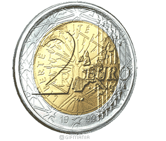
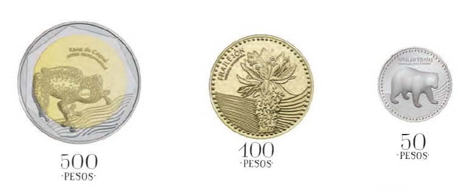

```{r setup, include=FALSE}
library(learnr)
knitr::opts_chunk$set(echo = FALSE)
```


## Moneda cargada

El experimento consiste en lanzar una moneda que está trucada de  manera que la probabilidad de obtener una cara es 2/3.



### Ejercicio 1 

Complete el código de abajo para simular *un* lanzamiento de esta moneda.

```{r moneda1, exercise=TRUE}
x <- runif(n=..., min=..., max=...)
resultado <- ifelse(..., "cara", ...)
print(resultado)
```

### Ejercicio 2 

Complete el código de abajo para crear una función que simule el lanzamiento de *n* monedas cargadas.

```{r moneda2, exercise=TRUE}
monedas <- function( ) {
  x <- runif(n=n, min=..., max=...)
  res <- ifelse(..., ..., "sello")
  return(res)
}

# Simulemos el lanzamiento de diez monedas
monedas(n=10)
```

### Ejercicio 3 

Complete el código de abajo para repetir tres veces el lanzamiento de diez monedas cargadas.

```{r moneda3, exercise=TRUE}
datos <- replicate(n=..., expr=...)
datos
```

### Ejercicio 4

Complete el código de abajo para repetir tres mil veces el lanzamiento de diez monedas cargadas.

```{r moneda4, exercise=TRUE}
datos <- replicate(n=..., expr=...)
```

### Ejercicio 5

Complete el código de abajo para calcular el porcentaje de veces en que se observaron *seis* caras al lanzar diez monedas cargadas.

```{r moneda5, exercise=TRUE}
mean(colSums(datos == "cara") == ...)
```

## Tres monedas

El experimento consiste en lanzar tres monedas normales, una de 50, una de 100 y una de 500.




### Ejercicio 1 

Complete el código de abajo para simular el lanzamiento de las tres monedas.

```{r tri_moneda1, exercise=TRUE}
 m50 <- ifelse(... < 0.5, "...", "sello")
m100 <- ifelse(... < 0.5, "cara", "...")
m500 <- ifelse(runif(n=1) < 0.5, "...", "...")

m50
m100
m500
```

### Ejercicio 2

Complete el código de abajo para crear una función que simule el lanzamiento de las tres monedas.

```{r tri_moneda2, exercise=TRUE}
tres_monedas <- ...() {
   m50 <- ifelse(runif(n=1) < 0.5, "...", "sello")
  m100 <- ifelse(runif(n=1) < ..., "cara", "...")
  m500 <- ifelse(runif(n=1) < 0.5, "...", "sello")
  result <- c(m50, ..., m500)
  return(...)
}

# Vamos a probar la funcion
tres_monedas()
```

### Ejercicio 3

Complete el código de abajo para simular *cinco* lanzamientos de las tres monedas.

```{r tri_moneda3, exercise=TRUE}
... <- ...(n=..., expr=tres_monedas())
datos
```

### Ejercicio 4

Complete el código de abajo para responder la siguiente pregunta:

¿Cuál es la probabilidad que al lanzar las tres monedas normales de 50, 100$ y 500 se obtenga cara, sello y cara respectivamente para las monedas de 50, 100 y 500?

```{r tri_moneda, exercise=TRUE}
...
...
```


